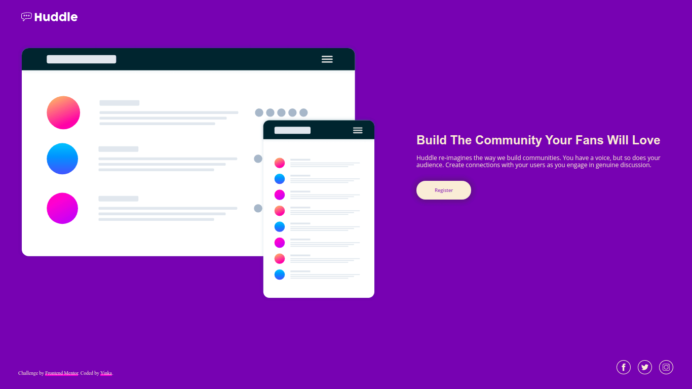

# Huddle landing page with single introductory section

Landing page website built with HTML & CSS. Part of the [Frontend Mentor](https://www.frontendmentor.io) challenge.

[Live Demo](https://huddleyinkakun.netlify.app)

## Frontend Mentor challenge

Supercharge your front-end skills by building in a real-life workflow
Solve real-world HTML, CSS and JavaScript challenges whilst working to professional quality designs. Build designs and review code alongside thousands of developers.

Frontend Mentor challenges provides static JPEG designs (mobile and a desktop version), starter code, project brief, front-end style guide and all required assets. The task is to build out the project and get it looking as close to the design as possible.

Goto [Frontend Mentor](https://www.frontendmentor.io/challenges) to browse all challenges.
